# Mycelium-Matrix Chat Integration

<div align="center">


[](LICENSE)
[](docs/ROADMAP.md)
[](#roadmap)
[](#roadmap)
[](docs/ops/security.md)
[](docs/ops/ansible-deployment.md)

**The next generation of decentralized messaging**

*Phase 1 MVP Complete • Production-Ready for chat.projectmycelium.org*

*Combining Matrix protocol's proven federation with Mycelium's encrypted overlay networking*

[📖 Documentation](#documentation) • [🚀 Quick Start](#quick-start) • [�️ Architecture](#architecture) • [🤝 Contributing](#contributing)

</div>

## �🎯 Overview

Mycelium-Matrix creates a revolutionary decentralized messaging system that enhances Matrix federation with Mycelium's encrypted IPv6 overlay networking. This integration delivers:

- **🔒 Enterprise Security**: Double encryption (Matrix E2EE + Mycelium transport) + secure credential handling
- **🌐 Universal Access**: Works immediately at chat.projectmycelium.org - no installation required
- **⚡ Progressive Enhancement**: Auto-detects and utilizes local Mycelium for P2P benefits
- **🛡️ Censorship Resistance**: Decentralized overlay routing bypasses traditional internet controls
- **🔄 Full Compatibility**: Matrix ecosystem integration with zero breaking changes
- **🚀 Production Ready**: Complete ansible-based deployment system for TFGrid
- **🔐 Enterprise Security**: Secure credential handling, SSH hardening, and access controls

### Key Innovation: Progressive Enhancement Model

```mermaid
graph LR
    A[User visits chat.projectmycelium.org] --> B{Mycelium detected?}
    B -->|No| C[Standard Web Mode<br/>🌐 HTTPS + Encrypted Federation]
    B -->|Yes| D[Enhanced P2P Mode<br/>🔒 Direct Overlay Routing]
    C --> E[Chat Works Perfectly]
    D --> E
    E --> F[Cross-compatible communication]
```



**Result**: Users can communicate seamlessly regardless of their technical setup, while those with Mycelium automatically get enhanced security and performance.

## ✨ Features

### Core Functionality
- **Matrix Protocol Compatibility**: Full Matrix Client-Server and Server-Server API support
- **Mycelium Network Integration**: IPv6 overlay networking with automatic peer discovery
- **Progressive Web App**: Responsive design works on desktop and mobile
- **Real-time Messaging**: Instant message delivery with typing indicators and read receipts
- **End-to-End Encryption**: Matrix's proven E2EE with additional transport layer security

### Enhanced Features (with Mycelium)
- **Direct P2P Communication**: Bypass homeservers for maximum privacy
- **Mesh Networking**: Works offline in local networks
- **Network Topology Awareness**: Visualize connections and routing
- **Advanced Privacy**: Network-level anonymity and traffic obfuscation
- **Automatic NAT Traversal**: Works behind firewalls and complex networks

### Enterprise Features
- **SSO Integration**: LDAP, SAML, and OAuth support
- **Administrative Dashboard**: User management and network monitoring
- **Compliance Tools**: Message retention and audit capabilities
- **High Availability**: Multi-node deployment with automatic failover
- **Monitoring & Alerts**: Comprehensive observability stack

## 🚀 Quick Start

### For Users

**Instant Access** - No installation required:
1. Visit **[chat.projectmycelium.org](https://chat.projectmycelium.org)** in your web browser
2. Create an account or sign in
3. Start chatting securely!

**Enhanced Experience** - Optional P2P benefits:
1. Install [Mycelium](https://github.com/threefoldtech/mycelium/releases) on your device
2. Return to chat.projectmycelium.org
3. Enjoy automatic P2P encryption and enhanced performance

### For Developers

**Development Setup Using Makefile**:
```bash
# Clone the repository
git clone https://github.com/mik-tf/mycelium-matrix-chat.git
cd mycelium-matrix-chat

# Quick development environment (Phase 1 MVP)
make setup-phase1

# Alternative: Local Matrix Bridge + Phase 2 components
make setup-phase2-local

# Comprehensive environment setup
make setup-full

# Access applications
open http://localhost:5173  # Frontend (Phase 1 MVP)
open http://localhost:8081  # Matrix Bridge (Phase 2)
```

**Makefile Commands Available**:
```bash
make test-phase1           # Test complete Phase 1 suite
make test-phase2           # Test Phase 2 components
make setup-phase2-local    # Deploy Matrix Bridge locally
make setup-phase2-prod     # Deploy to production (chat.projectmycelium.org)
make docs                  # Open Phase 1 docs
make docs-phase2           # Open Phase 2 deployment guide
```

**See [Development Guide](docs/DEVELOPMENT_GUIDE.md) for detailed setup instructions.**

### For Operators & Deployers

#### TFGrid Production Deployment (Ansible-Based System)

**Prerequisites**:
- Linux/macOS system with bash
- [tfcmd](https://github.com/threefoldtech/tfcmd) installed and configured
- [Ansible](https://www.ansible.com/) installed
- ThreeFold account with sufficient TFT balance
- SSH key pair (auto-detected from `~/.ssh/id_ed25519.pub` or `~/.ssh/id_rsa.pub`)
- **Security Note**: See [Security Documentation](./docs/ops/security.md) for secure credential handling

**Complete TFGrid Deployment**:
```bash
# Clone the repository
git clone https://github.com/mik-tf/mycelium-matrix-chat.git
cd mycelium-matrix-chat

# Deploy everything in one command (VM + preparation + MMC)
make deploy

# Alternative: Use OpenTofu for infrastructure (auto-fallback to Terraform)
make vm-tofu      # Deploy VM using OpenTofu (falls back to Terraform if needed)
make prepare      # Prepare VM with ansible (install Docker, Rust, Node.js, etc.)
make app          # Deploy MMC application components
make validate     # Validate the deployment

# Or deploy step-by-step with tfcmd:
make vm           # Deploy Ubuntu 24.04 VM on TFGrid using tfcmd
make prepare      # Prepare VM with ansible (install Docker, Rust, Node.js, etc.)
make app          # Deploy MMC application components
make validate     # Validate the deployment

# Access your deployment
make connect      # SSH into the deployed VM
make status       # Check deployment status
```

**Deployment Process**:
1. **VM Deployment** (`make vm`): Deploys Ubuntu 24.04 VM on TFGrid using tfcmd, extracts mycelium IPv6 address
2. **VM Preparation** (`make prepare`): Ansible installs all prerequisites (Docker, Rust, Node.js, Mycelium, Nginx, security)
3. **Application Deployment** (`make app`): Deploys MMC components with systemd services
4. **Validation** (`make validate`): Health checks and service verification

**Management Commands**:
```bash
make status       # Check deployment status and services
make connect      # SSH into deployed VM
make logs         # View ansible deployment logs
make clean        # Clean deployment artifacts (keeps VM)
make clean-all    # Clean everything including VM destruction (supports both tfcmd and OpenTofu)
make help         # Show all available commands
```

#### Legacy Production Deployment (Shell Scripts)

**Phase 2 Production Deployment**:
```bash
# Automatic deployment to chat.projectmycelium.org
make setup-phase2-prod    # Sets up production environment + SSL

# Manual deployment with deploy script
chmod +x deploy.sh
sudo ./deploy.sh          # Handles SSL, containers, and services

# Check deployment status
curl -k https://chat.projectmycelium.org/api/health
```

**Multi-environment Support**:
```bash
# Local development
docker-compose up -d              # Standard dev environment

# Local with Matrix Bridge
make setup-phase2-local           # Includes bridge service

# Production deployment
make setup-phase2-prod            # Full production setup
```

**See [Deployment Guide](docs/DEPLOYMENT_GUIDE.md), [Phase 2 Deployment](docs/ops/phase-2-deploy.md), and [Ansible Deployment Guide](docs/ops/ansible-deployment.md) for complete procedures.**

## 🏗️ Architecture

### High-Level System Design


### Progressive Enhancement Flow

1. **Universal Access**: All users can access chat.projectmycelium.org immediately
2. **Auto-Detection**: JavaScript detects local Mycelium installation
3. **Seamless Upgrade**: Enhanced users automatically get P2P routing
4. **Full Compatibility**: Both user types communicate without restrictions

### TFGrid Deployment Architecture

The new ansible-based deployment creates a complete MMC environment on TFGrid:


**Deployment Components**:
1. **tfcmd Integration**: Deploys Ubuntu 24.04 VM with Mycelium networking
2. **Ansible Automation**: 9 modular roles for complete system setup
3. **Service Management**: systemd services for all MMC components
4. **Health Validation**: Automated testing and monitoring

**See [Architecture Documentation](docs/ARCHITECTURE.md) and [Ansible Deployment Guide](docs/ops/ansible-deployment.md) for detailed technical design.**

## 🔐 Security Features

MMC implements enterprise-grade security practices following the same approach as tfgrid-k3s:

### Credential Security
- **Secure Environment Variables**: Use `set +o history` to prevent mnemonic from being stored in shell history
- **Git Protection**: Sensitive files automatically excluded from version control
- **Template-Based Setup**: Safe credential templates for easy configuration

### Infrastructure Security
- **SSH Hardening**: Key-only authentication, root login disabled
- **Firewall Management**: UFW rules with minimal required ports
- **Service Isolation**: All services run as dedicated non-root user (`muser`)
- **System Updates**: Security patches applied during deployment

### Deployment Security
- **Automated Validation**: Health checks and security verification
- **Access Controls**: Granular permissions and sudo configuration
- **Audit Logging**: Comprehensive deployment and service logs

### Industry-Standard Secure Credential Management

MMC supports multiple secure credential storage methods with automatic priority detection:

#### Method 1: Environment Variables (CI/CD, Automation)
```bash
# Bash/Zsh
set +o history
export TF_VAR_mnemonic="your_secure_mnemonic_here"
set -o history

# Fish Shell
set -l fish_history ""
set -x TF_VAR_mnemonic "your_secure_mnemonic_here"
```

#### Method 2: Secure Config Files (Development)
```bash
# Automated secure setup
./infrastructure/.secure/setup-config-file.sh

# Or manual setup
mkdir -p ~/.config/threefold
echo "your_mnemonic_here" > ~/.config/threefold/mnemonic
chmod 600 ~/.config/threefold/mnemonic
```

#### Priority Order:
1. **TF_VAR_mnemonic** environment variable (highest priority)
2. **~/.config/threefold/mnemonic** config file
3. **~/.threefold/mnemonic** alternative location
4. Interactive prompt (fallback)

#### Deployment Commands:
```bash
make deploy    # Complete deployment with automatic credential detection
make vm-tofu   # VM deployment only
make prepare   # Ansible preparation
make app       # MMC application deployment
make validate  # Security and health validation
make status    # Check deployment status
```

**✅ Variable Mapping**: `TF_VAR_mnemonic` → `var.mnemonic` → OpenTofu/Terraform provider

**📖 Complete Security Documentation**: See [Security Best Practices](./docs/ops/security.md) for comprehensive security guidelines, credential handling, and deployment security.

## 📁 Project Structure

```
mycelium-matrix-chat/
├── 📁 backend/                 # Rust backend services
│   ├── matrix-bridge/         # Matrix-Mycelium bridge service (PHASE 2 Built)
│   └── web-gateway/           # HTTPS gateway service
├── 📁 frontend/               # React web application (PHASE 1 Complete)
│   ├── src/                   # Source code
│   └── public/                # Static assets
├── 📁 infrastructure/         # OpenTofu/Terraform configuration for TFGrid
│   ├── main.tf               # Infrastructure definition
│   ├── variables.tf          # Variable definitions
│   ├── inventory.tpl         # Ansible inventory template
│   └── credentials.auto.tfvars.example # Credentials template (secure)
├── 📁 platform/               # Ansible infrastructure deployment (clean organization)
│   ├── ansible.cfg            # Ansible configuration for TFGrid deployment
│   ├── site.yml               # Main Ansible playbook
│   ├── inventory/             # Ansible inventory (auto-generated)
│   ├── group_vars/            # Ansible variables for MMC servers
│   └── roles/                 # Ansible roles for deployment (9 roles)
│       ├── common/            # System preparation and user setup
│       ├── docker/            # Docker installation and configuration
│       ├── rust/              # Rust toolchain installation
│       ├── nodejs/            # Node.js installation
│       ├── mycelium/          # Mycelium P2P client setup
│       ├── nginx/             # Web server configuration
│       ├── security/          # Firewall and SSH hardening
│       ├── mmc_deploy/        # MMC application deployment
│       └── validation/        # Post-deployment validation
├── 📁 config/                 # Configuration files for production
│   ├── nginx.conf            # Nginx reverse proxy configuration
│   └── mycelium.toml         # Mycelium node configuration
├── 📁 docker/                 # Docker configurations
│   ├── docker-compose.yml   # Development environment
│   ├── docker-compose.prod.yml  # Production deployment (Complete)
│   ├── init.sql             # Database initialization
│   └── ...
├── 📁 docs/                   # Comprehensive documentation
│   ├── ARCHITECTURE.md
│   ├── DEPLOYMENT_GUIDE.md
│   ├── DEVELOPMENT_GUIDE.md
│   ├── TODO.md               # Updated project status
│   └── ops/
│       ├── phase-1-test.md
│       ├── phase-2-deploy.md  # Phase 2 deployment guide
│       └── ansible-deployment.md # New ansible deployment guide
├── 📁 scripts/                # Legacy deployment scripts
│   ├── deploy.sh             # Production deployment script (Complete)
│   ├── tfcmd-deploy.sh       # VM deployment using tfcmd
│   ├── prepare-tfgrid-vm.sh  # VM preparation script
│   └── ...
├── site.yml                  # Main Ansible playbook
├── deploy-tfcmd-ansible.sh   # New unified TFGrid + Ansible deployment
├── .env.production          # Production environment configuration
├── Makefile                 # Enhanced with TFGrid deployment commands
└── Target/                  # Rust compilation artifacts
```

## 📖 Documentation

### Core Documentation
- **[Architecture](docs/ARCHITECTURE.md)** - Complete system architecture and design
- **[Technical Specification](docs/TECHNICAL_SPECIFICATION.md)** - Detailed implementation requirements
- **[API Specification](docs/API_SPECIFICATION.md)** - Complete API documentation
- **[User Experience](docs/USER_EXPERIENCE.md)** - UX flows and design specifications

### Implementation Guides
- **[Development Guide](docs/DEVELOPMENT_GUIDE.md)** - Step-by-step development setup
- **[Deployment Guide](docs/DEPLOYMENT_GUIDE.md)** - Production deployment procedures
- **[Ansible Deployment Guide](docs/ops/ansible-deployment.md)** - Complete TFGrid deployment system
- **[Security Documentation](docs/ops/security.md)** - Secure credential handling and best practices
- **[Roadmap](docs/ROADMAP.md)** - 16-week implementation timeline
- **[TODO List](docs/TODO.md)** - Comprehensive implementation checklist

### Project Information
- **[Project Summary](docs/PROJECT_SUMMARY.md)** - Executive summary and strategic overview

## 🛣️ Roadmap

### Phase 1: Foundation ✅ **COMPLETED**
- ✅ **Planning Complete** - Comprehensive architecture and documentation (Complete)
- ✅ **Core Infrastructure** - Matrix Gateway, Web Gateway, and database integration (Built)
- ✅ **Web Application** - React frontend with Matrix SDK integration (Running at localhost:5173)
- ✅ **Testing Infrastructure** - Automated testing setup with Makefile commands (Implemented)
- ✅ **Real Matrix Integration** - Complete with matrix.org federation support (Verified)

**Result**: Fully functional dramatically MVP at chat.projectmycelium.org ready for production

### Phase 2: P2P Enhancement 🔄 **95% COMPLETE**
- ✅ **Matrix Bridge Service** - Rust service with Docker production images (Built at localhost:8081)
- ✅ **Production Deployment Infra** - Docker Compose, SSL, Nginx config for chat.projectmycelium.org (Ready)
- ✅ **Development & Testing Setup** - Complete Phase 2 development cycle with Makefile (Implemented)
- ✅ **Enterprise Deployment System** - Complete ansible-based TFGrid deployment with OpenTofu support
- ✅ **Security & Credential Management** - Enterprise-grade security practices implemented
- ⏳ **Mycelium JS Integration** - Frontend P2P routing library (Next immediate task)
- ⏳ **Progressive Enhancement** - Auto Mycelium detection in chat interface (Ready to implement)

### Phase 3: Production & Mobile (Weeks 9-12)
- ⏳ **Production Hardening** - Monitoring, security, and Kubernetes deployment
- ⏳ **Mobile Applications** - iOS and Android with embedded Mycelium

### Phase 4: Advanced Features (Weeks 13-16)
- ⏳ **Mesh Networking** - Direct P2P messaging and offline capabilities
- ⏳ **Enterprise Features** - SSO, compliance tools, admin dashboards

**See [detailed roadmap](docs/ROADMAP.md) for complete timeline and milestones.**

## 🔧 Technology Stack (Actually Implemented)

### Backend ⚡ **PRODUCTION READY**
- **Language**: Rust (Compiled to release with 0 errors)
- **Framework**: Axum for HTTP services (Built Matrix Bridge and Web Gateway)
- **Database**: PostgreSQL with SQLx (Fully integrated with Docker)
- **Containerization**: Docker images ready for production deployment
- **Protocols**: Matrix Client-Server API, MySQLium overlay networking

### Frontend 💻 **PHASE 1 COMPLETE**
- **Framework**: React with TypeScript (Running at localhost:5173)
- **Build Tool**: Vite (Configured with Matrix SDK proxy)
- **UI**: Tailwind CSS, responsive mobile/desktop design
- **Matrix Integration**: Real matrix.org authentication working
- **State**: Complete chat interface with real-time messaging

### Infrastructure 🏗️ **ENTERPRISE DEPLOYMENT READY**
- **Containerization**: Docker Compose production ready (`docker-compose.prod.yml`)
- **SSL/TLS**: Let's Encrypt automated certificates
- **Reverse Proxy**: Nginx with security headers and rate limiting
- **Development Tools**: Enhanced Makefile with 15+ deployment commands
- **Deployment**: Automated script ready for chat.projectmycelium.org (`deploy.sh`)
- **TFGrid Deployment**: Complete ansible-based deployment system with tfcmd integration
- **Infrastructure as Code**: OpenTofu/Terraform support with automatic fallback
- **Configuration Management**: 9 modular ansible roles for automated setup
- **Service Management**: systemd services with health monitoring and logging
- **Security**: Enterprise-grade credential handling and access controls

### Networking 🔗 ** MATRIX INTEGRATION VERIFIED**
- **Matrix Protocol**: Real federation with matrix.org verified
- **Mycelium Network**: Configuration and peering setup ready
- **Transport**: HTTPS with security headers (production), HTTP (dev)
- **Federation**: Bridge service built for cross-server routing

## 🧪 Testing

### Automated Testing
```bash
# Backend tests
cd backend && cargo test

# Frontend tests
cd frontend && npm test

# Integration tests
docker-compose -f docker-compose.test.yml up --abort-on-container-exit

# Load testing
k6 run tests/load-test.js
```

### Test Coverage
- **Unit Tests**: >90% coverage for core components
- **Integration Tests**: End-to-end federation and messaging flows
- **Performance Tests**: Load testing and latency benchmarks
- **Security Tests**: Penetration testing and vulnerability scanning

### TFGrid Deployment Testing
```bash
# Test deployment validation
make validate

# Check service status
make status

# View deployment logs
make logs

# Manual service verification
curl http://[VM_IP]/health
curl http://[VM_IP]:8080/api/health
```

## 🤝 Contributing

We welcome contributions! **Phase 1 is complete** with a working MVP, and we're actively implementing Phase 2 Mycelium bridge integration.

### Current Project State
- ✅ **Phase 1 MVP**: React frontend + Matrix backend running at `localhost:5173`
- ✅ **Production Ready**: Complete deployment configuration for `chat.projectmycelium.org`
- 🔄 **Phase 2 Active**: Building Matrix Bridge service (90% complete)
- 🚀 **Next Focus**: Mycelium JS client library integration

### Getting Started
1. **Read the Documentation**: Start with current status in [TODO.md](docs/TODO.md)
2. **Set Up Development Environment**: Use `make setup-full` for complete environment
3. **Get Familiar**: `make setup-phase1` - Run the working MVP
4. **Deploy Phase 2**: `make setup-phase2-local` - Test Bridge service
5. **Check Deployment**: Learn about production setup with `make docs-phase2`

### Development Process
1. **Plan Your Contribution**: Check [TODO.md](docs/TODO.md) for current tasks
2. **Fork and Branch**: `git checkout -b feature/your-awesome-feature`
3. **Development Environment**: Use Makefile commands:
    - `make setup-full` - Complete dev setup
    - `make test-phase1` - Verify existing functionality
    - `make docs-phase2` - Understand Phase 2 goals
4. **Test Thoroughly**: `make test-phase2` for new features
5. **Test Deployment**: Use the new ansible system:
    - `make deploy` - Test full TFGrid deployment
    - `make validate` - Verify deployment works
6. **Document Changes**: Update relevant docs in `/docs`
7. **Create PR**: Conventional commit messages, detailed description

### Deployment Contributions
- **Test the ansible deployment system** on TFGrid
- **Improve ansible roles** for better reliability
- **Add monitoring and logging** enhancements
- **Contribute to deployment documentation**

### Areas Needing Contributors
- **🚨 Matrix Bridge JS Client**: Connect frontend to our Rust bridge service
- **⚡ Mycelium Browser Library**: Implement P2P messaging in JavaScript
- **🧪 Testing Infrastructure**: Expand automated Phase 2 testing
- **📱 Mobile Apps**: iOS/Android with embedded Mycelium
- **🔒 Security Hardening**: Production security improvements
- **📊 Monitoring Dashboards**: Grafana/Prometheus observability

### Quick Contribution Commands
```bash
# Develop Phase 2 features
make setup-phase2-local        # Run Bridge locally
make test-phase2              # Test your changes
make docs-phase2              # Read deployment guide

# Deploy to production when ready
make setup-phase2-prod        # Deploy complete system
```

## 🔧 Troubleshooting

### TFGrid Deployment Issues

#### VM Deployment Problems
```bash
# Check tfcmd status
tfcmd list

# Verify SSH key
ls -la ~/.ssh/id_ed25519.pub

# Check ThreeFold balance
tfcmd balance
```

#### Ansible Connection Issues
```bash
# Test SSH connection manually
ssh -o StrictHostKeyChecking=no -o UserKnownHostsFile=/dev/null -o ConnectTimeout=30 -i ~/.ssh/id_ed25519 root@VM_IP

# Check ansible connectivity
ansible -c platform/ansible.cfg -i platform/inventory/hosts.ini mmc_servers -m ping

# View ansible logs
make logs
```

#### Service Deployment Issues
```bash
# Check systemd services
make status

# View service logs on VM
ssh root@[VM_IP] "journalctl -u mmc-* -f"

# Restart services
ssh root@[VM_IP] "systemctl restart mmc-web-gateway mmc-matrix-bridge mmc-frontend"
```

#### Common Issues

**SSH Connection Failed**
- Verify VM IP in `platform/inventory/hosts.ini`
- Check SSH key permissions: `chmod 600 ~/.ssh/id_ed25519`
- Ensure VM has finished booting (wait 2-3 minutes after deployment)

**Ansible Role Failed**
- Check ansible logs: `make logs`
- Verify internet connectivity on VM
- Run roles individually: `ansible-playbook -c platform/ansible.cfg -i platform/inventory/hosts.ini platform/site.yml --tags role_name`

**Services Not Starting**
- Check service status: `make status`
- View detailed logs: `ssh root@[VM_IP] "journalctl -u mmc-service-name"`
- Verify dependencies: `ssh root@[VM_IP] "systemctl list-dependencies mmc-service-name"`

**Web Interface Not Accessible**
- Check Nginx status: `ssh root@[VM_IP] "systemctl status nginx"`
- Verify firewall: `ssh root@[VM_IP] "ufw status"`
- Test local access: `ssh root@[VM_IP] "curl http://localhost"`

### Getting Help

1. **Check Documentation**: [Ansible Deployment Guide](docs/ops/ansible-deployment.md)
2. **View Logs**: `make logs` for deployment logs
3. **Manual Testing**: SSH into VM and check services manually
4. **Clean Retry**: `make clean && make deploy` for fresh deployment

## 📄 License

This project is licensed under the Apache License 2.0 - see the [LICENSE](LICENSE) file for details.

## 🙏 Acknowledgments

- **[Matrix](https://matrix.org/)** - For the robust federation protocol and ecosystem
- **[Mycelium](https://github.com/threefoldtech/mycelium)** - For the innovative overlay networking technology
- **[ThreeFold](https://threefold.io/)** - For supporting decentralized internet infrastructure
- **Open Source Community** - For the tools and libraries that make this project possible

## 📞 Support & Community

- **Documentation**: [Complete documentation](docs/)
- **Issues**: [GitHub Issues](https://github.com/mik-tf/mycelium-matrix-chat/issues)

---

<div align="center">

**🌟 Star this repository if you're excited about the future of decentralized communication! 🌟**

</div>
