# Mycelium-Matrix Chat Integration

<div align="center">


[](LICENSE)
[](docs/ROADMAP.md)

**The next generation of decentralized messaging**

*Combining Matrix protocol's proven federation with Mycelium's encrypted overlay networking*

[📖 Documentation](#documentation) • [🚀 Quick Start](#quick-start) • [🏗️ Architecture](#architecture) • [🤝 Contributing](#contributing)

</div>

## 🎯 Overview

Mycelium-Matrix creates a revolutionary decentralized messaging system that enhances Matrix federation with Mycelium's encrypted IPv6 overlay networking. This integration delivers:

- **🔒 Enhanced Security**: Double encryption (Matrix E2EE + Mycelium transport)
- **🌐 Universal Access**: Works immediately at chat.threefold.pro - no installation required
- **⚡ Progressive Enhancement**: Auto-detects and utilizes local Mycelium for P2P benefits
- **🛡️ Censorship Resistance**: Decentralized overlay routing bypasses traditional internet controls
- **🔄 Full Compatibility**: Matrix ecosystem integration with zero breaking changes

### Key Innovation: Progressive Enhancement Model

```mermaid
graph LR
    A[User visits chat.threefold.pro] --> B{Mycelium detected?}
    B -->|No| C[Standard Web Mode<br/>🌐 HTTPS + Encrypted Federation]
    B -->|Yes| D[Enhanced P2P Mode<br/>🔒 Direct Overlay Routing]
    C --> E[Chat Works Perfectly]
    D --> E
    E --> F[Cross-compatible communication]
```



**Result**: Users can communicate seamlessly regardless of their technical setup, while those with Mycelium automatically get enhanced security and performance.

## ✨ Features

### Core Functionality
- **Matrix Protocol Compatibility**: Full Matrix Client-Server and Server-Server API support
- **Mycelium Network Integration**: IPv6 overlay networking with automatic peer discovery
- **Progressive Web App**: Responsive design works on desktop and mobile
- **Real-time Messaging**: Instant message delivery with typing indicators and read receipts
- **End-to-End Encryption**: Matrix's proven E2EE with additional transport layer security

### Enhanced Features (with Mycelium)
- **Direct P2P Communication**: Bypass homeservers for maximum privacy
- **Mesh Networking**: Works offline in local networks
- **Network Topology Awareness**: Visualize connections and routing
- **Advanced Privacy**: Network-level anonymity and traffic obfuscation
- **Automatic NAT Traversal**: Works behind firewalls and complex networks

### Enterprise Features
- **SSO Integration**: LDAP, SAML, and OAuth support
- **Administrative Dashboard**: User management and network monitoring
- **Compliance Tools**: Message retention and audit capabilities
- **High Availability**: Multi-node deployment with automatic failover
- **Monitoring & Alerts**: Comprehensive observability stack

## 🚀 Quick Start

### For Users

**Instant Access** - No installation required:
1. Visit **[chat.threefold.pro](https://chat.threefold.pro)** in your web browser
2. Create an account or sign in
3. Start chatting securely!

**Enhanced Experience** - Optional P2P benefits:
1. Install [Mycelium](https://github.com/threefoldtech/mycelium/releases) on your device
2. Return to chat.threefold.pro
3. Enjoy automatic P2P encryption and enhanced performance

### For Developers

**Development Setup**:
```bash
# Clone the repository
git clone https://github.com/mik-tf/mycelium-matrix-chat.git
cd mycelium-matrix-chat

# Quick development environment
docker-compose up -d

# Access the application
open http://localhost:3000
```

**See [Development Guide](docs/DEVELOPMENT_GUIDE.md) for detailed setup instructions.**

### For Operators

**Deploy your own homeserver**:
```bash
# Production deployment with Docker
docker-compose -f docker-compose.prod.yml up -d

# Or with Kubernetes
helm install mycelium-matrix ./helm/mycelium-matrix
```

**See [Deployment Guide](docs/DEPLOYMENT_GUIDE.md) for production deployment.**

## 🏗️ Architecture

### High-Level System Design


### Progressive Enhancement Flow

1. **Universal Access**: All users can access chat.threefold.pro immediately
2. **Auto-Detection**: JavaScript detects local Mycelium installation
3. **Seamless Upgrade**: Enhanced users automatically get P2P routing
4. **Full Compatibility**: Both user types communicate without restrictions

**See [Architecture Documentation](docs/ARCHITECTURE.md) for detailed technical design.**

## 📁 Project Structure

```
mycelium-matrix-chat/
├── 📁 backend/                 # Rust backend services
│   ├── matrix-bridge/         # Matrix-Mycelium bridge service
│   ├── web-gateway/           # HTTPS gateway service
│   └── shared/                # Shared libraries
├── 📁 frontend/               # React web application
│   ├── src/                   # Source code
│   └── public/                # Static assets
├── 📁 mobile/                 # Mobile applications
│   ├── ios/                   # iOS app
│   └── android/               # Android app
├── 📁 docs/                   # Comprehensive documentation
├── 📁 scripts/                # Development and deployment scripts
├── 📁 docker/                 # Docker configurations
├── 📁 helm/                   # Kubernetes Helm charts
└── 📁 tests/                  # Integration tests
```

## 📖 Documentation

### Core Documentation
- **[Architecture](docs/ARCHITECTURE.md)** - Complete system architecture and design
- **[Technical Specification](docs/TECHNICAL_SPECIFICATION.md)** - Detailed implementation requirements
- **[API Specification](docs/API_SPECIFICATION.md)** - Complete API documentation
- **[User Experience](docs/USER_EXPERIENCE.md)** - UX flows and design specifications

### Implementation Guides
- **[Development Guide](docs/DEVELOPMENT_GUIDE.md)** - Step-by-step development setup
- **[Deployment Guide](docs/DEPLOYMENT_GUIDE.md)** - Production deployment procedures
- **[Roadmap](docs/ROADMAP.md)** - 16-week implementation timeline
- **[TODO List](docs/TODO.md)** - Comprehensive implementation checklist

### Project Information
- **[Project Summary](docs/PROJECT_SUMMARY.md)** - Executive summary and strategic overview

## 🛣️ Roadmap

### Phase 1: Foundation (Weeks 1-4)
- ✅ **Planning Complete** - Comprehensive architecture and documentation
- 🔄 **Core Infrastructure** - Matrix-Mycelium bridge development
- 🔄 **Web Application** - Basic chat interface and Matrix integration

### Phase 2: Enhancement (Weeks 5-8)
- 🔜 **Progressive Enhancement** - Auto-detection and P2P routing
- 🔜 **Testing & Optimization** - Performance tuning and comprehensive testing

### Phase 3: Production (Weeks 9-12)
- 🔜 **Production Hardening** - Security, monitoring, and deployment
- 🔜 **Mobile Applications** - iOS and Android apps with embedded Mycelium

### Phase 4: Ecosystem (Weeks 13-16)
- 🔜 **Advanced Features** - Direct P2P, mesh networking, file sharing
- 🔜 **Community Tools** - Plugin system and developer ecosystem

**See [detailed roadmap](docs/ROADMAP.md) for complete timeline and milestones.**

## 🔧 Technology Stack

### Backend
- **Language**: Rust
- **Framework**: Axum for HTTP services
- **Database**: PostgreSQL with SQLx
- **Caching**: Redis
- **Messaging**: Mycelium overlay network

### Frontend
- **Framework**: React 18 with TypeScript
- **Build Tool**: Vite
- **State Management**: Zustand + React Query
- **UI Components**: Custom components with Tailwind CSS
- **Matrix SDK**: matrix-js-sdk

### Infrastructure
- **Containerization**: Docker and Docker Compose
- **Orchestration**: Kubernetes with Helm charts
- **Monitoring**: Prometheus, Grafana, and custom dashboards
- **CI/CD**: GitHub Actions with automated testing

### Networking
- **Matrix Protocol**: Full Client-Server and Server-Server API compliance
- **Mycelium Network**: IPv6 overlay with end-to-end encryption
- **Transport**: HTTPS for web users, direct overlay for enhanced users

## 🧪 Testing

### Automated Testing
```bash
# Backend tests
cd backend && cargo test

# Frontend tests  
cd frontend && npm test

# Integration tests
docker-compose -f docker-compose.test.yml up --abort-on-container-exit

# Load testing
k6 run tests/load-test.js
```

### Test Coverage
- **Unit Tests**: >90% coverage for core components
- **Integration Tests**: End-to-end federation and messaging flows
- **Performance Tests**: Load testing and latency benchmarks
- **Security Tests**: Penetration testing and vulnerability scanning

## 🤝 Contributing

We welcome contributions! This project is in the planning phase and ready for implementation.

### Getting Started
1. **Read the Documentation**: Start with [Architecture](docs/ARCHITECTURE.md) and [Development Guide](docs/DEVELOPMENT_GUIDE.md)
2. **Set Up Development Environment**: Follow the [quick start](#for-developers) instructions
3. **Check the TODO List**: See [TODO.md](docs/TODO.md) for implementation tasks
4. **Join the Community**: Connect with other developers and users

### Development Process
1. Fork the repository
2. Create a feature branch (`git checkout -b feature/amazing-feature`)
3. Make your changes following our coding standards
4. Add tests for new functionality
5. Commit with conventional commit messages
6. Push to your branch and open a Pull Request

### Areas for Contribution
- **Backend Development**: Rust services and Matrix integration
- **Frontend Development**: React components and user experience
- **Mobile Development**: iOS and Android applications
- **Documentation**: Improve guides and tutorials
- **Testing**: Automated tests and quality assurance
- **Security**: Security audits and vulnerability research

## 📄 License

This project is licensed under the Apache License 2.0 - see the [LICENSE](LICENSE) file for details.

## 🙏 Acknowledgments

- **[Matrix](https://matrix.org/)** - For the robust federation protocol and ecosystem
- **[Mycelium](https://github.com/threefoldtech/mycelium)** - For the innovative overlay networking technology
- **[ThreeFold](https://threefold.io/)** - For supporting decentralized internet infrastructure
- **Open Source Community** - For the tools and libraries that make this project possible

## 📞 Support & Community

- **Documentation**: [Complete documentation](docs/)
- **Issues**: [GitHub Issues](https://github.com/mik-tf/mycelium-matrix-chat/issues)
- **Discussions**: [GitHub Discussions](https://github.com/mik-tf/mycelium-matrix-chat/discussions)
- **Matrix Room**: `#mycelium-matrix:matrix.org`

---

<div align="center">

**🌟 Star this repository if you're excited about the future of decentralized communication! 🌟**

*Made with ❤️ by the decentralized internet community*

</div>