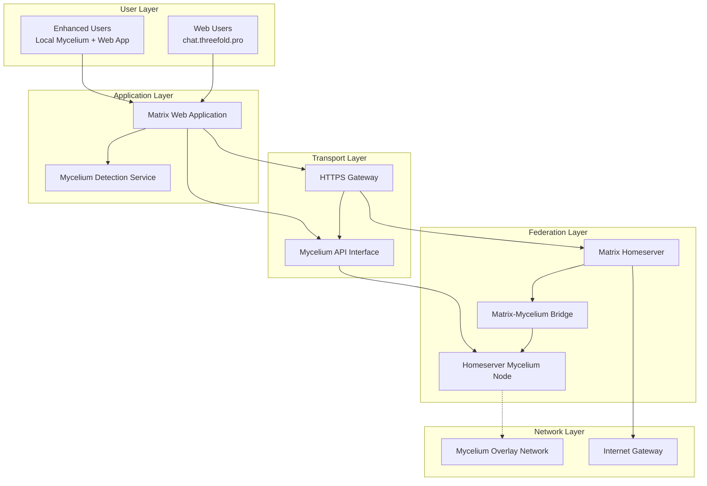
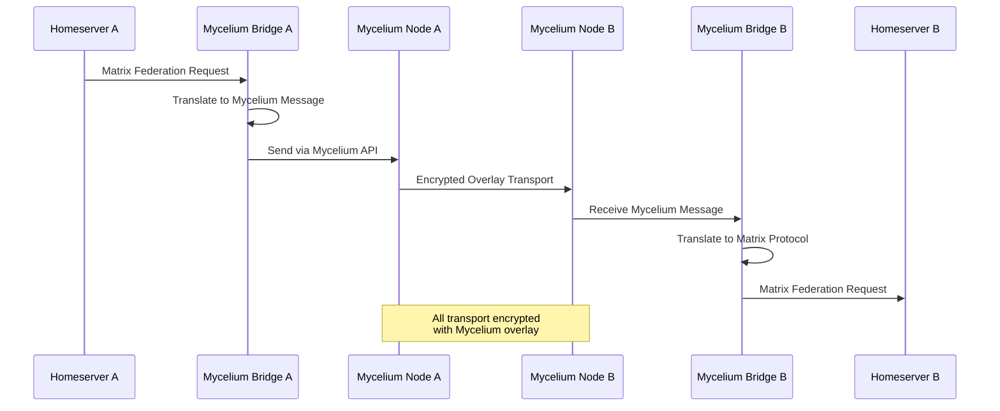
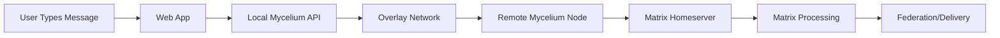
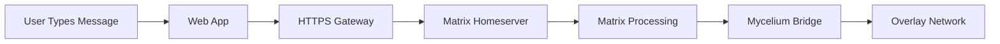

# Mycelium-Matrix Architecture

## 🎯 System Overview

The Mycelium-Matrix integration creates a hybrid communication system that combines the proven Matrix federation protocol with Mycelium's encrypted overlay networking to deliver enhanced security, privacy, and censorship resistance.

## 🏗️ Core Architecture

### High-Level System Design



## 🔄 Progressive Enhancement Architecture

### Dual-Path Design

The system operates on two parallel paths that converge at the Matrix homeserver level:

#### Path 1: Standard Web Access
```
User Browser → HTTPS → Web Gateway → Matrix Homeserver → Mycelium Node → Overlay Network
```

#### Path 2: Enhanced P2P Access
```
User Browser → Local Mycelium API → Overlay Network → Remote Mycelium Node → Matrix Homeserver
```

### Auto-Detection Mechanism

```javascript
// Simplified detection flow
async function detectMyceliumCapability() {
    try {
        const response = await fetch('http://localhost:8989/api/v1/admin', {
            timeout: 1000
        });
        return response.ok ? 'enhanced' : 'standard';
    } catch {
        return 'standard';
    }
}
```

## 🛡️ Security Architecture

### Multi-Layer Encryption

1. **Application Layer**: Matrix end-to-end encryption between users
2. **Transport Layer**: Mycelium overlay network encryption
3. **Network Layer**: TLS for web gateway connections

### Authentication & Identity

- **Matrix Identity**: Standard Matrix user IDs and homeserver domains
- **Mycelium Identity**: x25519 cryptographic keys for network identity
- **Hybrid Mapping**: Bridge between Matrix domains and Mycelium public keys

### Security Benefits by User Type

| User Type | Encryption Layers | Network Anonymity | Censorship Resistance |
|-----------|------------------|-------------------|----------------------|
| Web Users | Matrix E2EE + TLS | Partial (to homeserver) | Moderate (federation level) |
| Enhanced Users | Matrix E2EE + Mycelium | Full (end-to-end) | Maximum (overlay routing) |

## 🌐 Federation Architecture

### Traditional vs Mycelium Federation

#### Traditional Matrix Federation
```
Homeserver A → DNS Lookup → HTTPS → Homeserver B
```

#### Mycelium-Enhanced Federation
```
Homeserver A → Mycelium Bridge → Overlay Network → Mycelium Bridge → Homeserver B
```

### Federation Message Flow



## 📊 Component Architecture

### Core Components

#### 1. Matrix Homeserver
- **Purpose**: Standard Matrix server functionality
- **Modifications**: Federation transport layer hooks
- **Dependencies**: Matrix-Mycelium Bridge

#### 2. Matrix-Mycelium Bridge
- **Purpose**: Protocol translation between Matrix and Mycelium
- **Functions**: 
  - Matrix API to Mycelium message translation
  - Server discovery and routing
  - State synchronization management
- **Implementation**: Rust service with HTTP API

#### 3. Mycelium Node
- **Purpose**: Overlay network participation
- **Features**: 
  - IPv6 overlay networking
  - End-to-end encryption
  - Automatic routing and discovery
- **Configuration**: Private network mode for Matrix federation

#### 4. Web Application
- **Purpose**: User interface and client logic
- **Features**:
  - Progressive enhancement detection
  - Matrix Client-Server API
  - Mycelium API integration
- **Technology**: Modern web application (React/Vue/Svelte)

#### 5. HTTPS Gateway
- **Purpose**: Traditional web access for standard users
- **Functions**:
  - TLS termination
  - Request routing
  - Authentication proxy
- **Implementation**: Nginx/Traefik with custom modules

### Data Flow Architecture

#### User Message Flow (Enhanced User)


#### User Message Flow (Standard User)


## 🔧 Integration Points

### Matrix Integration
- **Client-Server API**: Standard Matrix endpoints
- **Server-Server API**: Custom Mycelium transport
- **Federation Events**: Translated to Mycelium messages
- **Room State**: Synchronized via Mycelium reliable delivery

### Mycelium Integration
- **Message Topics**: Matrix federation event types
- **Socket Forwarding**: HTTP API bridge
- **Identity Mapping**: Matrix domains to Mycelium keys
- **Network Discovery**: Automatic peer discovery

## 📈 Scalability Architecture

### Network Topology
- **Mesh Network**: Full Mycelium overlay participation
- **Geographic Distribution**: Regional homeserver clusters
- **Load Balancing**: Mycelium automatic routing
- **Fault Tolerance**: Self-healing network topology

### Performance Optimizations
- **Message Batching**: Combine federation events
- **Caching**: Room state and federation data
- **Connection Pooling**: Persistent Mycelium connections
- **Compression**: Message payload optimization

## 🛠️ Deployment Architecture

### Single Node Deployment
```
[Matrix Homeserver] → [Mycelium Bridge] → [Mycelium Node] → [Overlay Network]
                    ↓
[HTTPS Gateway] ← [Web Application]
```

### High Availability Deployment
```
[Load Balancer] → [Multiple Homeservers] → [Bridge Cluster] → [Mycelium Nodes] → [Overlay Network]
                                       ↓
[CDN] ← [Web Application Cluster]
```

### Container Architecture
```yaml
services:
  matrix-homeserver:
    depends_on: [mycelium-bridge]
  
  mycelium-bridge:
    depends_on: [mycelium-node]
  
  mycelium-node:
    network_mode: host
  
  web-gateway:
    depends_on: [matrix-homeserver]
  
  web-app:
    depends_on: [web-gateway]
```

This architecture provides a robust foundation for secure, decentralized communication while maintaining full compatibility with existing Matrix ecosystem and providing clear benefits for users at every technical level.