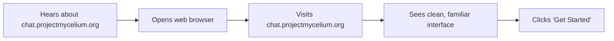
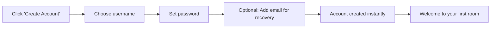
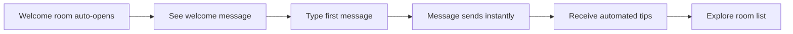
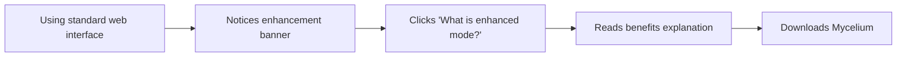
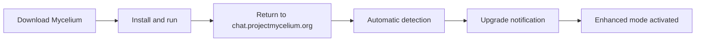
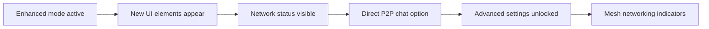
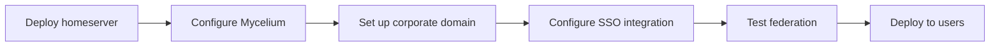
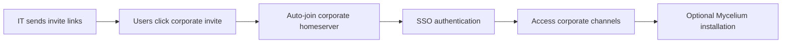

# User Experience Guide

## 🎯 User Personas & Scenarios

### Persona 1: Casual User (Sarah)
**Background**: Non-technical user, values ease of use
**Primary Goal**: Simple, secure messaging
**Technical Comfort**: Low
**Device**: Smartphone, occasionally laptop

### Persona 2: Privacy-Conscious User (Alex)
**Background**: Tech-savvy, concerned about surveillance  
**Primary Goal**: Maximum security and privacy
**Technical Comfort**: High
**Device**: Multiple devices with custom configurations

### Persona 3: Enterprise Administrator (Jordan)
**Background**: IT professional managing corporate communications
**Primary Goal**: Secure internal communications with easy management
**Technical Comfort**: High
**Device**: Enterprise infrastructure

## 🌐 User Journey Flows

### Journey 1: First-Time Casual User (Sarah)

#### Step 1: Discovery & Access


**Experience Design**:
- **Landing Page**: Clear value proposition, no technical jargon
- **Visual Cues**: Familiar chat interface similar to WhatsApp/Telegram
- **Onboarding**: Simple 3-step process
- **Security Message**: "Your messages are automatically encrypted"

#### Step 2: Account Creation


**UX Principles**:
- **Minimal friction**: Only essential information required
- **Instant gratification**: Immediate access to chat
- **Clear security**: "No phone number required, enhanced privacy"
- **Progressive disclosure**: Advanced features introduced later

#### Step 3: First Chat Experience


**Key Features**:
- **Auto-join welcome room**: Immediate social proof
- **Interactive tutorial**: Learn by doing
- **Status indicators**: Connection quality shown subtly
- **Gentle guidance**: Non-intrusive tips and suggestions

### Journey 2: Enhanced User Upgrade (Alex)

#### Step 1: Learning About Enhancement


**Enhancement Banner**:
```html
<div class="enhancement-banner">
  🔒 Enhanced Security Available
  <button>Install Mycelium for peer-to-peer encryption</button>
  <span class="learn-more">Learn more</span>
</div>
```

#### Step 2: Mycelium Installation


**Auto-Detection Experience**:
```javascript
// User sees immediate feedback
showNotification({
  type: 'success',
  title: 'Enhanced Mode Activated!',
  message: 'Your connection is now peer-to-peer encrypted',
  icon: '🚀'
});

updateStatusIndicator({
  type: 'enhanced',
  text: 'P2P Connected',
  color: 'green'
});
```

#### Step 3: Enhanced Features Discovery


**Progressive Feature Reveal**:
- **Network visualization**: See Mycelium mesh topology
- **Direct messaging**: P2P chat without homeserver
- **Offline capabilities**: Local mesh networking
- **Advanced privacy**: Connection routing options

### Journey 3: Enterprise Deployment (Jordan)

#### Step 1: Infrastructure Setup


**Admin Dashboard**:
```typescript
interface AdminDashboard {
  // Network topology view
  networkStatus: NetworkTopology;
  
  // User management
  userCount: number;
  activeConnections: Connection[];
  
  // Federation status
  federatedServers: FederationServer[];
  messageVolume: MessageStats;
  
  // Security monitoring
  encryptionStatus: EncryptionMetrics;
  threatDetection: SecurityAlert[];
}
```

#### Step 2: User Onboarding


**Corporate Onboarding Flow**:
- **Branded interface**: Company colors and logo
- **SSO integration**: Seamless login with corporate credentials
- **Channel auto-join**: Automatic access to relevant teams/projects
- **Policy compliance**: Built-in retention and compliance features

## 📱 Cross-Platform Experience

### Web Application UX

#### Responsive Design
```css
/* Mobile-first responsive design */
.chat-container {
  display: grid;
  grid-template-areas: 
    "header"
    "messages"
    "input";
  height: 100vh;
}

@media (min-width: 768px) {
  .chat-container {
    grid-template-areas: 
      "sidebar header"
      "sidebar messages"
      "sidebar input";
    grid-template-columns: 300px 1fr;
  }
}
```

#### Progressive Web App Features
- **Offline support**: Cache recent messages and rooms
- **Push notifications**: Real-time message alerts
- **Install prompt**: "Add to home screen" for mobile users
- **Background sync**: Message delivery when app reopens

### Mobile Application UX

#### Native App Benefits
```typescript
interface NativeFeatures {
  // System integration
  pushNotifications: boolean;
  backgroundSync: boolean;
  contactsIntegration: boolean;
  
  // Mycelium integration
  embeddedMycelium: boolean;
  meshNetworking: boolean;
  offlineMessaging: boolean;
  
  // Performance
  nativeRendering: boolean;
  hardwareAcceleration: boolean;
  batteryOptimization: boolean;
}
```

#### Mobile-Specific UX
- **Swipe gestures**: Reply, react, delete messages
- **Voice messages**: Quick voice note recording
- **Image sharing**: Camera integration and photo library
- **Contact discovery**: Find friends via phone contacts (optional)

## 🔄 Connection State Management

### Visual Indicators

#### Connection Status Display
```typescript
interface ConnectionStatus {
  type: 'enhanced' | 'standard' | 'connecting' | 'offline';
  quality: 'excellent' | 'good' | 'fair' | 'poor';
  latency?: number;
  throughput?: number;
}

function getStatusColor(status: ConnectionStatus): string {
  switch (status.type) {
    case 'enhanced': return '#00ff00'; // Green
    case 'standard': return '#ffaa00'; // Orange  
    case 'connecting': return '#0088ff'; // Blue
    case 'offline': return '#ff0000'; // Red
  }
}

function getStatusIcon(status: ConnectionStatus): string {
  switch (status.type) {
    case 'enhanced': return '🔒'; // Lock for security
    case 'standard': return '🌐'; // Globe for web
    case 'connecting': return '⏳'; // Hourglass
    case 'offline': return '⚠️'; // Warning
  }
}
```

#### Status Messages
```typescript
const statusMessages = {
  enhanced: {
    title: 'Enhanced P2P Mode',
    description: 'Direct encrypted connection via Mycelium',
    benefits: ['Maximum privacy', 'Faster routing', 'Censorship resistant']
  },
  standard: {
    title: 'Standard Web Mode', 
    description: 'Secure connection via HTTPS',
    benefits: ['No installation required', 'Works everywhere', 'Federation encrypted'],
    upgrade: 'Install Mycelium for enhanced security'
  }
};
```

### Transition Animations

#### Smooth Mode Switching
```css
.connection-indicator {
  transition: all 0.3s ease-in-out;
  display: flex;
  align-items: center;
  gap: 8px;
}

.connection-indicator.enhanced {
  background: linear-gradient(45deg, #00ff00, #00aa00);
  animation: pulse 2s infinite;
}

.connection-indicator.standard {
  background: linear-gradient(45deg, #ffaa00, #ff8800);
}

@keyframes pulse {
  0%, 100% { opacity: 1; }
  50% { opacity: 0.7; }
}
```

## 🎨 UI/UX Design Principles

### Visual Design

#### Color Scheme
```scss
// Primary palette
$primary-enhanced: #00ff88;    // Enhanced mode green
$primary-standard: #ff8800;    // Standard mode orange
$primary-dark: #1a1a1a;       // Dark theme background
$primary-light: #ffffff;      // Light theme background

// Semantic colors
$success: #00ff00;            // Success states
$warning: #ffaa00;            // Warning states  
$error: #ff4444;              // Error states
$info: #0088ff;               // Information states

// Text colors
$text-primary: #333333;       // Primary text
$text-secondary: #666666;     // Secondary text
$text-muted: #999999;         // Muted text
```

#### Typography
```scss
// Font hierarchy
.text-title {
  font-size: 24px;
  font-weight: 700;
  line-height: 1.2;
}

.text-body {
  font-size: 16px;
  font-weight: 400;
  line-height: 1.5;
}

.text-caption {
  font-size: 14px;
  font-weight: 400;
  line-height: 1.4;
  color: $text-secondary;
}
```

### Interaction Design

#### Button States
```scss
.button {
  padding: 12px 24px;
  border-radius: 8px;
  border: none;
  font-weight: 600;
  cursor: pointer;
  transition: all 0.2s ease;
  
  &:hover {
    transform: translateY(-1px);
    box-shadow: 0 4px 8px rgba(0,0,0,0.1);
  }
  
  &:active {
    transform: translateY(0);
  }
  
  &.primary {
    background: $primary-enhanced;
    color: white;
  }
  
  &.secondary {
    background: transparent;
    color: $primary-enhanced;
    border: 2px solid $primary-enhanced;
  }
}
```

#### Loading States
```typescript
interface LoadingState {
  type: 'spinner' | 'skeleton' | 'progress';
  message?: string;
  progress?: number;
}

function LoadingIndicator({ state }: { state: LoadingState }) {
  switch (state.type) {
    case 'spinner':
      return <div className="spinner">{state.message}</div>;
    case 'skeleton':
      return <div className="skeleton-loader" />;
    case 'progress':
      return <ProgressBar value={state.progress} />;
  }
}
```

## 📊 Accessibility & Usability

### Accessibility Standards

#### WCAG 2.1 AA Compliance
- **Color contrast**: Minimum 4.5:1 ratio for normal text
- **Keyboard navigation**: Full keyboard accessibility
- **Screen reader support**: Semantic HTML and ARIA labels
- **Focus management**: Clear focus indicators and logical tab order

#### Implementation
```typescript
// Accessibility helpers
const a11yProps = {
  role: 'button',
  'aria-label': 'Send message',
  'aria-describedby': 'send-button-help',
  tabIndex: 0,
  onKeyDown: (e: KeyboardEvent) => {
    if (e.key === 'Enter' || e.key === ' ') {
      handleSendMessage();
    }
  }
};
```

### Usability Testing

#### Key Metrics
- **Task completion rate**: >95% for core messaging tasks
- **Time to first message**: <30 seconds for new users
- **Error recovery rate**: >90% users recover from errors
- **User satisfaction**: >4.5/5 rating for ease of use

#### Testing Scenarios
1. **New user onboarding**: Account creation to first message
2. **Mode switching**: Standard to enhanced transition
3. **Error handling**: Network issues and recovery
4. **Cross-platform**: Consistency across web/mobile

This comprehensive UX guide ensures the Mycelium-Matrix integration provides an excellent user experience across all user types and technical levels.