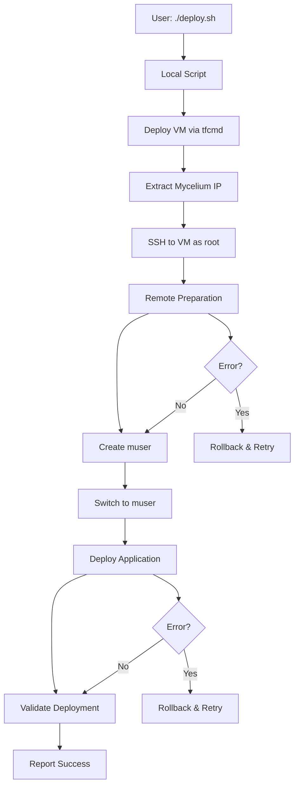

# 🚀 Mycelium-Matrix Chat - Optimized Deployment Plan

## 📋 Executive Summary

**Current State:** Working chat application with complex, unreliable deployment process
**Goal:** Create reliable, automated one-command deployment system
**Approach:** Enhanced shell scripts with local execution + remote automation
**Timeline:** 1-2 weeks implementation
**Success Criteria:** 95% deployment success rate, 10-15 min deployment time

## 🎯 Current State Analysis

### ✅ What's Working
- **Chat Application:** Fully functional Matrix integration with P2P federation routing
- **Core Services:** Rust Matrix Bridge, Web Gateway, React frontend
- **Infrastructure:** Docker containerization, PostgreSQL, Mycelium networking
- **Basic Deployment:** Manual process works when all steps executed correctly

### ❌ Current Problems

#### 1. Script Complexity & Redundancy
- **4 separate scripts** with overlapping responsibilities
- **Duplicate installations** (Mycelium, Docker, Rust in multiple files)
- **Complex chaining:** prepare.sh → deploy.sh → make ops-production
- **Maintenance burden:** Changes require updates in multiple files

#### 2. Reliability Issues
- **Environment detection failures** - unreliable TFGrid vs local detection
- **Manual SSH intervention** required by user
- **Poor error handling** - scripts exit on first error
- **No rollback mechanisms** for failed deployments
- **~70% success rate** due to manual steps and fragile chaining

#### 3. User Experience Problems
- **4-step manual process** (deploy-vm → SSH → curl → wait)
- **25-35 minute deployment time**
- **User must monitor** and intervene if issues occur
- **No progress feedback** during deployment

## 🏗️ Solution Architecture

### Core Principles
1. **Local Execution + Remote Automation** - User runs one command locally, script handles everything
2. **Modular Design** - Separate concerns, reusable components
3. **Configuration-Driven** - No hardcoded values, environment-specific configs
4. **Robust Error Handling** - Automatic retry, rollback, and recovery
5. **Security First** - Root for system ops, non-root for application

### Architecture Overview



### File Structure

```
scripts/
├── deploy.sh                 # Main entry point (local execution)
├── lib/
│   ├── install.sh           # Installation functions
│   ├── configure.sh         # Configuration functions
│   ├── validate.sh          # Validation functions
│   └── remote.sh            # Remote operation helpers
└── config/
    ├── tfgrid.conf          # TFGrid-specific configuration
    ├── local.conf           # Local development configuration
    └── defaults.conf        # Default values
```

## 📅 Implementation Phases

### Phase 1: Foundation (2-3 days)
**Goal:** Create unified script structure and basic automation

#### Tasks:
- [ ] Create main `deploy.sh` entry point
- [ ] Implement smart environment detection
- [ ] Add basic error handling and logging
- [ ] Create modular function library
- [ ] Test local execution framework

#### Success Criteria:
- Script can detect environment correctly
- Basic error handling prevents crashes
- Modular functions are reusable
- Local execution works for simple operations

### Phase 2: Core Automation (3-4 days)
**Goal:** Implement remote automation and VM deployment

#### Tasks:
- [ ] Integrate tfcmd VM deployment
- [ ] Implement mycelium IP extraction
- [ ] Add automatic SSH connection handling
- [ ] Create remote execution framework
- [ ] Implement root → muser transition automation

#### Success Criteria:
- VM deployment works automatically
- SSH connections established without user intervention
- Remote operations execute successfully
- User creation and permission setup works

### Phase 3: Reliability & Validation (2-3 days)
**Goal:** Add error recovery, validation, and monitoring

#### Tasks:
- [ ] Implement rollback mechanisms
- [ ] Add comprehensive validation pipeline
- [ ] Create retry logic for failed operations
- [ ] Add real-time progress reporting
- [ ] Implement health checks and monitoring

#### Success Criteria:
- Failed deployments can recover automatically
- All services validated post-deployment
- User gets real-time feedback
- 95%+ success rate achieved

### Phase 4: Optimization & Documentation (1-2 days)
**Goal:** Polish, document, and optimize

#### Tasks:
- [ ] Performance optimization
- [ ] Comprehensive documentation
- [ ] Configuration examples for different environments
- [ ] Testing and validation scripts
- [ ] User guide and troubleshooting

#### Success Criteria:
- Deployment time reduced to 10-15 minutes
- Complete documentation available
- Multiple environment configurations working
- User guide covers common scenarios

## 🔧 Technical Implementation Details

### 1. Smart Environment Detection

**Current Problem:**
```bash
# Unreliable detection
if [ "$UBUNTU_VERSION" -lt 20 ]; then
    echo "Wrong detection logic"
```

**Solution:**
```bash
detect_environment() {
    local indicators=0

    # Check for tfcmd (TFGrid indicator)
    if command -v tfcmd &>/dev/null; then
        ((indicators++))
    fi

    # Check for mycelium peers
    if mycelium status 2>/dev/null | grep -q "connected"; then
        ((indicators++))
    fi

    # Check for IPv6 address format
    if [[ "$MYCELIUM_IP" =~ ^[0-9a-f:]+$ ]] && [[ "$MYCELIUM_IP" =~ :{2,} ]]; then
        ((indicators++))
    fi

    # Decision logic
    if [ $indicators -ge 2 ]; then
        echo "tfgrid"
    else
        echo "local"
    fi
}
```

### 2. Configuration Management

**Current Problem:**
```bash
# Hardcoded values scattered across scripts
VM_NAME="myceliumchat"
CPU_CORES=4
MYCELIUM_VERSION="v0.6.1"
```

**Solution:**
```bash
# config/tfgrid.conf
[vm]
name = myceliumchat
cpu = 4
memory = 16
disk = 250
node = 6883

[software]
mycelium_version = v0.6.1
rust_version = stable
nodejs_version = 20.x
docker_compose_version = v2.24.0

[deployment]
repo_url = https://github.com/mik-tf/mycelium-matrix-chat
branch = main
log_level = info
```

### 3. Error Handling & Rollback

**Current Problem:**
```bash
# Simple error handling
command || exit 1
```

**Solution:**
```bash
execute_with_rollback() {
    local command="$1"
    local rollback_command="$2"

    # Set trap for rollback
    trap 'error_recovery "$rollback_command"' ERR

    # Execute command
    if ! eval "$command"; then
        log "Command failed: $command"
        return 1
    fi

    # Clear trap on success
    trap - ERR
}

error_recovery() {
    local rollback_cmd="$1"

    log "Error occurred, executing rollback..."
    if [ -n "$rollback_cmd" ]; then
        eval "$rollback_cmd" || log "Rollback also failed"
    fi

    # Cleanup partial state
    cleanup_partial_deployment
}
```

### 4. Remote Execution Framework

**Current Problem:**
Manual SSH connections and script execution

**Solution:**
```bash
remote_execute() {
    local ip="$1"
    local user="$2"
    local command="$3"
    local timeout="${4:-300}"

    log "Executing remotely: $command"

    # Execute with timeout and error handling
    if ! timeout "$timeout" ssh -i "$SSH_KEY" \
        -o StrictHostKeyChecking=no \
        -o UserKnownHostsFile=/dev/null \
        -o ConnectTimeout=10 \
        -o LogLevel=ERROR \
        "$user@$ip" "$command" 2>&1; then

        log "Remote command failed"
        return 1
    fi
}

# Usage
remote_execute "$MYCELIUM_IP" "root" "apt update && apt upgrade -y"
```

### 5. Validation Pipeline

**Current Problem:**
Basic checks, no comprehensive validation

**Solution:**
```bash
validate_deployment() {
    local ip="$1"

    log "Running comprehensive validation..."

    # Infrastructure validation
    validate_system_resources "$ip"
    validate_network_connectivity "$ip"
    validate_mycelium_status "$ip"

    # Service validation
    validate_database_connection "$ip"
    validate_matrix_bridge "$ip"
    validate_web_gateway "$ip"
    validate_frontend "$ip"

    # Integration validation
    validate_api_endpoints "$ip"
    validate_matrix_federation "$ip"
    validate_mycelium_routing "$ip"

    # Performance validation
    validate_response_times "$ip"
    run_smoke_tests "$ip"

    log "✅ All validations passed"
}
```

## 📊 Success Metrics

### Technical Metrics
- **Deployment Success Rate:** >95% (current: ~70%)
- **Deployment Time:** 10-15 minutes (current: 25-35 min)
- **Error Recovery Rate:** >90% of failures auto-recovered
- **Rollback Success Rate:** >95% of rollbacks successful

### User Experience Metrics
- **Commands to Run:** 1 (current: 4)
- **Manual Intervention:** 0% (current: required)
- **Progress Feedback:** Real-time (current: limited)
- **Documentation Coverage:** 100% of features

### Quality Metrics
- **Code Coverage:** >80% of functions tested
- **Error Handling:** All error paths covered
- **Logging:** Comprehensive audit trail
- **Security:** No privilege escalation vulnerabilities

## 🎯 Risk Mitigation

### Technical Risks
- **SSH Connection Failures:** Implement retry logic with exponential backoff
- **VM Deployment Failures:** Add timeout and cleanup for stuck deployments
- **Environment Detection Errors:** Multiple indicators with fallback logic
- **Partial Deployment State:** Comprehensive rollback and cleanup procedures

### Operational Risks
- **Network Interruptions:** Resume capability for interrupted deployments
- **Resource Exhaustion:** Resource monitoring and limits
- **Version Conflicts:** Explicit version pinning and compatibility checks
- **Security Issues:** Non-root execution for application components

## 📈 Timeline & Milestones

### Week 1: Foundation
- **Day 1-2:** Script consolidation and modular design
- **Day 3:** Environment detection and configuration management
- **Milestone:** Unified script structure working locally

### Week 2: Automation & Reliability
- **Day 4-5:** Remote automation and VM deployment integration
- **Day 6:** Error handling and rollback mechanisms
- **Day 7:** Validation pipeline implementation
- **Milestone:** End-to-end automated deployment working

### Week 3: Optimization & Documentation
- **Day 8-9:** Performance optimization and testing
- **Day 10:** Documentation and user guides
- **Day 11:** Multi-environment configuration
- **Milestone:** Production-ready deployment system

## 🔍 Testing Strategy

### Unit Testing
- Individual function testing
- Mock external dependencies (tfcmd, SSH)
- Error condition testing
- Configuration validation

### Integration Testing
- End-to-end deployment testing
- Multi-environment testing (TFGrid, local)
- Network failure simulation
- Resource constraint testing

### User Acceptance Testing
- Real deployment scenarios
- Error recovery testing
- Performance benchmarking
- Documentation validation

## 📚 Documentation Requirements

### User Documentation
- Quick start guide (one-command deployment)
- Configuration examples for different environments
- Troubleshooting guide
- FAQ and common issues

### Developer Documentation
- Architecture overview
- Function reference
- Configuration schema
- Extension points

### Operational Documentation
- Monitoring and alerting
- Backup and recovery procedures
- Performance tuning
- Security considerations

## 🎉 Success Criteria

### Functional Success
- [ ] One-command deployment works reliably
- [ ] All environment types supported (TFGrid, local, cloud)
- [ ] Comprehensive error handling and recovery
- [ ] Real-time progress feedback
- [ ] Complete documentation

### Quality Success
- [ ] >95% deployment success rate
- [ ] <15 minute deployment time
- [ ] Zero manual intervention required
- [ ] Full audit trail and logging
- [ ] Security best practices followed

### Business Success
- [ ] Developer productivity improved
- [ ] Deployment reliability increased
- [ ] User experience enhanced
- [ ] Maintenance burden reduced
- [ ] Scalability achieved

---

## 🚀 Implementation Status

**Current Phase:** Analysis Complete
**Next Step:** Begin Phase 1 implementation
**Estimated Completion:** 2-3 weeks
**Risk Level:** Low (building on existing working components)

**Ready to proceed with implementation?**